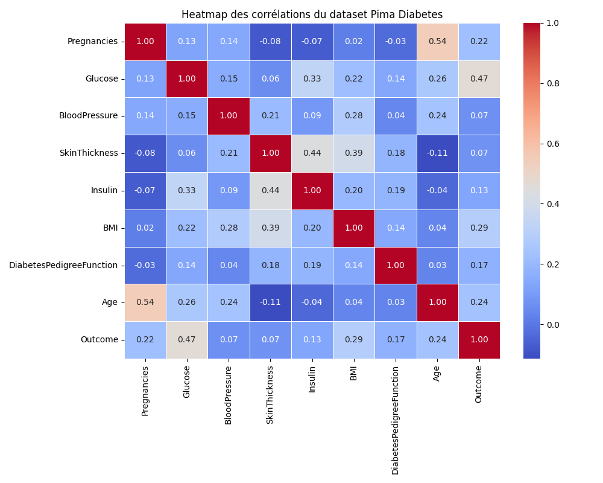

# Health Data Analysis

Analyse des données du dataset Pima Diabetes (768 exemples, 9 variables) pour explorer les facteurs associés au diagnostic du diabète.

## Description du dataset

Ce jeu de données contient les mesures médicales suivantes pour des patientes :
- `Pregnancies` : nombre de grossesses
- `Glucose` : taux de glucose plasmatique
- `BloodPressure` : tension artérielle diastolique
- `SkinThickness` : épaisseur du pli cutané
- `Insulin` : taux d'insuline
- `BMI` : indice de masse corporelle
- `DiabetesPedigreeFunction` : fonction de pedigree du diabète
- `Age` : âge
- `Outcome` : diagnostic (0 = négatif, 1 = positif)

## Principale découverte

On observe une forte corrélation positive entre le taux de glucose, l'IMC et un diagnostic positif de diabète.

## Heatmap des corrélations

## Comment utiliser

1. Placer `pima_diabetes_data.csv` dans `archive/`
2. Lancer le script `generate_heatmap.py` pour générer `heatmap.png`
3. Ouvrir ce `README.md` pour visualiser l'analyse
